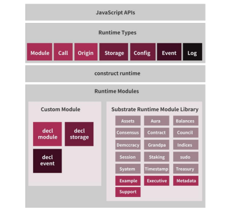
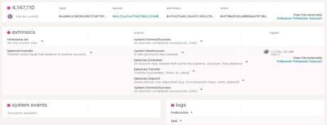
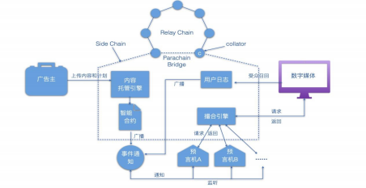
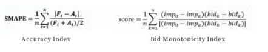
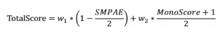
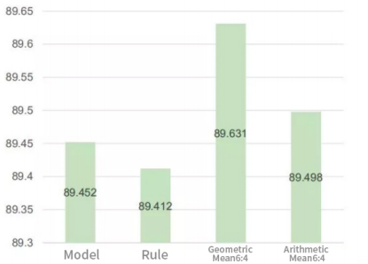
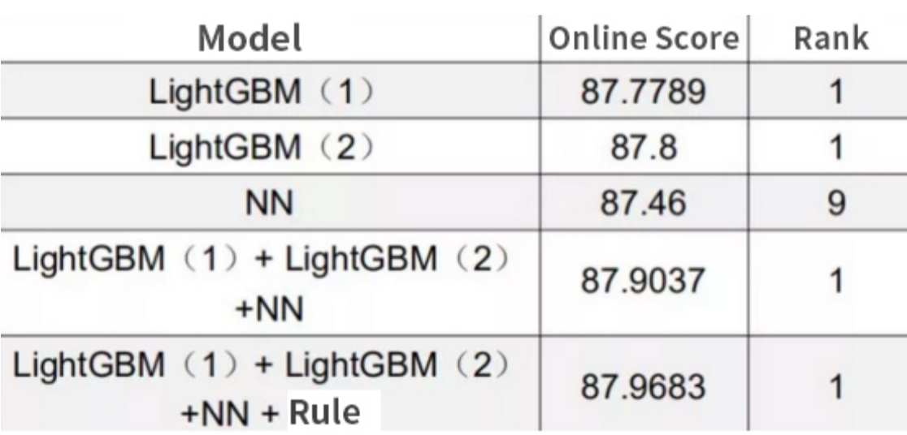

# General Grant Proposal

> This document is referenced in the terms and conditions and therefore needs to contain all the required information. Don't remove any of the mandatory parts presented in bold letters or as headlines! See the [Open Grants Program Process](https://github.com/w3f/Open-Grants-Program/blob/master/README_2.md) on how to submit a proposal.

* **Project Name:** Jambo Network

* **Team Name:** Jambo Network
* **Payment Address:** 0x3e53029a2d870161d5894861a101419e6c985660

## Project Overview
### Overview

#### A brief description of your project

As the first blockchain ad-tech support platform, Jambo has been committed to creating a transparent and credible decentralized advertising industry value ecology. With the Polkadot heterogeneous multi-chain architecture, the platform can realize the value interoperability of different advertising industry chains, make the database transparent, greatly improve the service development of the blockchain advertising industry, and accelerate the serving efficiency of digital advertising.

Jambo has continued deepening the value of on-chain traffic and improving the accuracy of blockchain information. The application of blockchain technology has broken the border of the financial field or entertainment field to build the high-traffic data applications of the advertising communication industry based on blockchain technology, thus directly or indirectly helping users filter false information.

#### An indication of how your project relates to integrates into Substrate Polkadot Kusama

The underlying operating system framework of a blockchain must meet at least the following five requirements:

Modular functions

Interoperability of data and assets

Transaction scalability

Decentralized governance and iterative upgrade

On-demand security

We use Substrate to build our own application chain. Polkadot plus Substrate can meet all the five basic requirements. Modular functions are the biggest highlight of Substrate. As long as you use Substrate to develop a blockchain, you will enjoy the loosely coupled modules. The following figure shows the division of modules bySubstrate.

The interoperability of data and assets requires the use of Polka Dots functions. As

we can see from the Polkadot architecture diagram, as long as we are connected to the Polkadot slot, the validator node of the relay chain can verify the data and assets to open up with other parachains connected to the slot. Of course, we can also communicate with the existing main blockchain through the connection bridge. This connectivity solution can also be expanded through the second-layer relay chain.

Transaction also requires scalability for an application. When a parachain cannot support the transaction of a certain application chain, new parachains can be used to continuously expand the transaction. Therefore, in the ecology of Polkadot plus the rapid development of Substrate, developers can easily meet the ever-expanding demand. Of course, when a relay chain cannot meet the demand, multi-layer relays can also be used to continuously expand the number of parachains.

Substrate's framework is naturally friendly to governance. The biggest problem of blockchain development so far is the source of credit. Blockchain is said to be naturally trustworthy, which is correct to a certain extent. It is indeed verifiable, If, like Ethereum, it cannot be changed once the contract is released. As long as it is verifiable, it is trustworthy. No one needs to trust the person who issued the contract because they can verify it themselves. However, the problem is that the contract cannot be iteratively upgraded. Blockchain products that have been launched definitely evolve iteratively, and iterative upgrades should be realized. Asa launched application chain service, the system certainly needs to achieve the characteristics of iterative upgrade. However, by doing so, it needs to solve the problem of trust and disallow unauthorized upgrade by the developer. It is absolutely a bad idea if we have to trust the developer unconditionally.

Upgrade requires a governance structure, which combines on-chain and off-chain governance, so that the application chain can iteratively adapt to market development needs.

Every developer needs to consider on-demand security distribution. The cost of absolute security is high. Relative security is good enough for application chains in certain scenarios. The security of the Polkadot ecosystem can be provided through its own consensus mechanism, or provided

through Polkadot's consensus mechanism. After access to the slot, you do not need to maintain the verification node by yourself, which enables you to focus on application and function realization.

#### An indication of why your team is interested in creating this project

In the global Internet advertising market worth trillions of U.S. dollars, marketing budgets are mainly grasped by major media such as search engines and social media.

Due to the lack of trust between stakeholders in the industry chain, non-value parts such as advertisement verification, data monitoring, and advertisement blocking have appeared.

The high trust cost has led to the transfer of interests of all parties, causing a high user acquisition cost for advertisers on the one hand, and a lack of competitiveness for small-and-medium-sized media firms to compete with giant monopolies on the other hand.

What's worse, users are disturbed and irritated by annoying advertisements. The main reasons are as follows:

**Traffic Fraud**

Seduced by high profits, traffic fraud is serious in the mobile advertising market. Risky equipment such as device farms (such as phone farms) and virtual machines have wasted advertising resources for a long time, affecting the advertising effectiveness.

**Data Silo**

However, companies, large and small, are fighting their battles separately, forming large and small silos in the vast data ocean. This situation can do great harmby hindering advertisers from acquiring valid consumer data and breaking the data chain that is key for effective advertising.

**Advertising Harassment**

In the process of mobile advertising,Personal information security cannot be guaranteed.Sometimes, upstream advertisers can delay payments developers for more than two months, squeezing the liquidity of small-and-medium-sized developers.

**Extra Costs Caused by Agents**

In the process of mobile advertising, endless agents such as DSP, ADX, SSP andDMP have increased the advertising transaction cost. Moreover, the billing period of each agent causes a weak position for developers. Sometimes, upstream advertisers can delay payments developers for more than two months, squeezing the liquidity of small-and-medium-sized developers.

Jambo enables the advertising industry's service network to provide transparent, efficient and stable communication services for the industry. We are committed to helping users to participate in blockchain advertising applications, promoting implementation of high-traffic applications in the application ecosystem, gathering new potential development teams to build a large-traffic reference matrix in digital advertising, and affecting the traffic circle of multiple industries and communities, thus enabling more people to enjoy the development dividends of high-traffic applications.

## Project Details

### Mockups designs of any UI components

* Chain related information

 

* Related information in the block

 

* Oracle node related information

 

### API specifications of the core functionality

We provide a simple and easy-to-use front-end JS component that wraps a series of functions for accessing parachain data and exposes API interfaces to provide services for JSON RPC calls from applications to nodes. It handles all encoding and decoding parameters, provides access to RPC functions, and allows queryingchainstatus and committing transaction progress.

The specifications of the API are as follows:

The static .create( ) interface returns an interface instance when the connection is successful and ready for use. The ApiOptions parameter can contain an optional WsProvider or Https Provider and some user-defined options {provider:, types: }. The above generated instance is a simple encapsulation of new Api( ), and the interface is available when the instance status is isReady.

api.rpc.. provides a real RPC access interface, which can be used to access, submit, subscribe, and receive information on the Parachain.

api.query.. provides a lightweight interface to access the status of the Parachain. All on-chain status information is dynamically populated based on the content provided at runtime.

api.tx.. provides an interface for creating transactions, storing data on the chain, or changing data on the chain, such as changing the status of the Parachain. api.consts.. is used to access the constants of various modules, such as module parameters.

### An overview of the technology stack to be used

Polkadot's Substrate framework modularized many functions of the blockchain while maintaining many customizable functions and modules. For example, the underlying communication module, account system, and consensus mechanism can all be customized by themselves. Therefore, we use Substrate to build Polkadot parachain applications.

Due to the needs of the advertising business scenario, the Parachain needs to achieve large-scale real-time response, and the advertising content needs to be returned to the front-end display within an average of 100ms. It is difficult to meet the requirements in a decentralized network, so the system adopts a combination of decentralization and centralization (similar to Chainlink). We build an advertisement matching engine on the chain, and use the advertisement recommendation system as an oracle machine. As for the off-chain, the reputation value of the oracle is calculated through the user log on the chain. In the matching engine, the most suitable oracle is selected and given by the probability weighting of the reputation value. reward.

Parachain integrates the identity system, reputation system, anti-fingerprint system, decentralized voting, and some additional anti-fraud technologies to create a significantly more transparent environment that convinces advertisers. At the sametime, users are allowed to set their own preferences, monetize their own data, and open it to traffic providers to match advertisements that are more suitable for them. Users will get their own public/private matching keys, and they can also choose them. Information willing to share. The system uses their private key to generate an intermediate key (Diffie Hellman Key Exchange). The intermediate key can be used to encrypt user information and send the information (HTTPS) to the chain and store it with AES256 encryption.

Using a series of machine learning algorithms and manual review (voting or phisher punishment) to provide data for publishers and advertisers can ensure a complete network environment. All clicks and usage traces will be analyzed by the system in real time. The identity and reputation system guarantees the ecosystem by providing a reliable and protective layer to prevent it from being harmed by bad advertisements, users or publishers.

### Documentation of core components, protocols, architecture,etc.to be deployed

**Advertiser advertises**

Advertisers post their advertising needs to the advertising trading platform, andthe advertisement producer participates in the bidding; the winning advertisement producer begins to produce multimedia advertising content, including but not limited to pictures, videos, web pages, AR, VR, etc., and the production is completed and delivered to the advertisers.

Advertisers draw up costs, formulate advertising plans, call the upper-level application interface to upload advertising content and advertising plans. After the blockchain client receives all the upper-level applications and calls, it creates a transaction containing the original advertisement request. After the verification node in the parachain receives the transaction created by the blockchain, it will verify the signature to ensure the transaction If it is legal, start the advertising hosting engine and store the transaction information in the pending queue. In a decentralized network, there may be cases in which advertisers and advertising

content producers jointly do evil, so advertising content needs to be reviewed and approved by the entire network. When the review is completed, the ad hosting engine starts tasks in parallel:

- Extract features of advertising content and generate MetaData; 
- The advertisement content is divided into pieces, and each piece is encrypted, anda hash index and merkle root are generated;
- Advertiser’s delivery plan, metadata and content hash index to generate advertising smart contract;

When the task is completed, the advertising hosting will include the advertising smart contract in the newly added block, and at the same time broadcast the new delivery plan to the entire network in the form of news. The oracle receives the message, pulls the smart contract from the chain and indexes it.

Digital advertising media broadcast advertising When the advertising audience touches the advertising digital media, the digital media collects user information through edge computing, creates a unique digital identity for each user, and sends the user's digital identity to the advertising matching engine. The advertisement matching engine sends the media attributes and the user's digital identity to the oracles participating in the advertising ecology, and waits for the oracles to return the recommended advertising content.

Inside the oracle:

- Query user logs based on the user's digital identity
- Load the smart contract according to the index
- Analyze user logs and extract user characteristics
- Match user characteristics, filter contracts, estimate -click-through rate -Calculate the ranking of advertisements according to the -bidding price in the contract
- Return recommended ad content

 After receiving the advertising content returned by different oracle machines, thematching engine selects the content recommended by the oracle machine with better effect and reputation based on internal algorithms and probability weighting, and returns the final advertising content hash value to the digital media. The digital media obtains the hash value of the advertisement content, and requests the secret key and streaming media content from the advertisement hosting engine, decrypts the returned secret key in the( trust zone) within the system and generates the decryption key for the streaming media content, anduses the The secret key decrypts each piece of streaming media content and plays the advertising content to the advertising audience.

After the broadcast is completed, the broadcast result is broadcast to the entire network, the user log is updated, and the single broadcast amount in the smart

contract is automatically transferred to the digital media and the oracle that has the right to recommend this time.

**User behavior recall**

Digital media needs to bury points for the follow-up behavior of the advertising audience before the advertisement is broadcast. After the advertising audience receives the advertisement in the digital media, the digital media needs to continuously collect the follow-up behaviors of the advertising audience, such as whether the audience clicks, whether to watch repeatedly, whether to generate related consumption, etc., and complete the user log on the chain. Furthermore, audiences can also set their own preferences, monetize their own data, and openit to traffic providers to match advertisements that are more suitable for them. All data generates an intermediate key (Diffie Hellman Key Exchange) based on the user's public key. The intermediate key can be used to encrypt user information and send the information (HTTPS) to the on-chain user log, which is encrypted and stored by AES256. Digital identities and digital assets based on blockchain technology are both open, anonymous and non-tamperable, and can completely solve the problem of false traffic that has plagued the advertising industry for many years.

**PoC/MVP or other relevant prior work or research on the topic**

From the user's access to digital media to the display of advertisement content to the user, the system needs to go through a series of processes such as user tag extraction, advertisement tag extraction, advertisement retrieval, click-through rate estimation, advertisement ranking, and user behavior recall. Each process will contain many sub-processes. For example, advertisement sorting includes complex logic calculations such as advertisement bidding logic, budget management, and so on. At the same time, due to the particularity of the advertising scene, the system needs to push the advertising content to the digital advertising media and display it to the advertising audience within a unit time of milliseconds. However, in a decentralized network environment, it is difficult to meet business requirements.

We abstract the business logic of selecting advertisements into the oracles under the chain. Each oracle under the chain provides basic computing power to match appropriate advertising content for the digital media on the chain. Through the advertisement matching engine, the advertisement content that accurately matches the user's attributes is screened out, and at the same time, a certain reward is given to the oracle. In the entire ecosystem, better-quality prediction opportunities will get more rewards, prompting oracles to continuously improve computing power and optimize algorithms, and further promote the continuous development of the ecology.

We built an instance of an advertising oracle and used online data to verify the accuracy of the advertising oracle. The process is as follows:

**Data**

- Historical log data: ad request time, user ID, ad slot ID, bidding advertisement information, etc.
- User information data: including user ID, age, gender, region, behavioral interests, etc.
- Advertising data: advertising operation information, advertising static information**Aims**

Forecast the daily exposure of advertisements

**Evaluation index**

The evaluation index is composed of two parts, the accuracy index and the bid

monotonicity index.

The final score is a combination of two indicators, the former controls accuracy and the latter controls monotonicity.

**Algorithm model**

The entire model consists of two main steps:

Feature extraction: use compressed interactive network CIN (xDeepFM), key-value storage (Key-Value, Word2Vec and DeepWalk ）four model units to extract features

respectively, and finally merge them into tensors Feed the neural network training. The user log has extracted user behavior data and converted it into a text sequence. Therefore, it is only necessary to monitor the news of the user log changes, andappend the modified data to the local database of the oracle and analyze it. The specific process is as follows:

1. Use word2vec algorithm to embed the advertisement, you can get the embedding of the advertisement content.

2. In the recommended scenario, the graph structure is more present among data objects. A typical scenario is a global relationship graph generated from user behavior data and advertisements. At this time, word2vec can't show this relationship well, so the system chooses Graph Embeding, and specifically usesDeepWalk, which can convert user behavior records into relationship graphs.

3. Compressed Interaction Network (CIN) is used to further extract data features, mainly considering the following factors:
  * User behavior is a large-scale sparse data
  * Interaction is applied at the vector level, not at the bit level (3) High-level feature interaction is clearly measured (4) The complexity of the network does not increase with the degree of interactionThe outer product in each dimension is used for feature interaction, and the result tensor obtained is the intermediate result of further learning.

4. Use the neural model of Key-Value Memory to realize the mappingof floating-point numbers to vectors；

5. Compared with the direct use of floating-point numbers, this method retains more semantic information;

6. Compared with the method of binning and serving as a category feature, the neighboring vectors of this method are correlated;

7. Compared with the numerical × vector method, this method has non-linear characteristics;

8. Make full use of exposure log records to cluster advertisements based on user behavior.

9. Finally, the extracted features are combined and input into the neural network for training.

**Validation results**

**Online score and ranking：**

## EcosystemFit

Similar to Vidy, BAT and other projects that belong to the advertising field, they are more of an application platform for blockchain advertising. The difference between

JAMBO is to create a blockchain advertising technology support platform to maintain a large number of developers for related projects. With customized functions and modules, JAMBO provides basic technical services and opens the underlying technical network services, which has become a regular option for developers in the process of business design and system development. By usingPolkadot Ecological Substrate to build your own application chain, data andassetshave interoperability, so that more people can enjoy the dividends of the development of high-traffic applications.

## Team 
### Team members

Co-Founder Jco Leung；

CTO Rowan Wood;

COO MaIte Kunert;

CMO ArtemVasilyev

**Name of team leader：**

Co-Founder Jco Leung

**Names of team members：**

Jambo Network

### Team Website

https://jambo.network 

### Legal Structure

Name：BITWAY TECHNOLOGY PTY LTD

Type：Australian Proprietary Company, Limited By Shares Locality of registered

Office: SYDNEY NSW 2000

### Team’s experience

counterparty.io (https://github.com/CounterpartyXCP/counterparty-lib) ，For theentire counterparty project, Rowan Wood is responsible for coordinating the programming of the code.

### Team Code Repos

[https://github.com/CounterpartyXCP/counterparty-lib](https://www.google.com/url?q=https://github.com/CounterpartyXCP/counterparty-lib&sa=D&source=editors&ust=1622050253751000&usg=AOvVaw3nyxFKERj0RKtEUHFHSvVF)

### Team LinkedIn Profiles

Jco Leung，CO-Founder，https://www.linkedin.com/in/jco-leung-74267520a Artem Vasilyev ，CMO，http://linkedin.com/in/artem-vasilyev-1a5a8b140 Rowan Wood，CTO ，https://www.linkedin.com/in/rowan-wood/ MaIte Kunert，COO ，https://www.linkedin.com/in/malte-k-40859b20a/

## Development Roadmap

### Overview

**Total Estimated Duration**: 4 Months for version1.0

**Full-time equivalent (FTE)**: 6

**Total Costs**: $58,500

 

### Milestone 1：Jambo Substract Parachain

- **Estimated Duration:** 6 Weeks
- **FTE:** 5
- **Costs:** $5,400

| **Number** | **Deliverable**                              | **Specification**                                            |
| ---------- | -------------------------------------------- | ------------------------------------------------------------ |
| 0a.        | License                                      | MIT                                                          |
| 0b.        | White paper                                  | Compile the project white paper, detailing the project background, business logic, technical architecture, project ecology and token system. |
| 0c.        | Project official website, operating channels | Make the official website of the project, upload the relevant information of the project to the official website link, build the media operation channel, and build the project community. |
| 0d.        | Project documentation                        | Compile project-related documents, including: business model, technical architecture, detailed description of each technical module, substract framework integration, interface specification definition. |
| 0e.        | Testing Guide                                | All relevant codes are subject to rigorous testing, so relevant test cases need to be written to make the test coverage above 90%. In this stage, we will write relevant test documents, including test specification, test module, module test cases, test process documents, and automation test documents. |
| 0f.        | Testnet                                      | Build a testnet.                                             |
| 1.         | Substract advertising module                 | Create a Substrate advertising module, which will manage advertising metadata, including advertising metadata formatting and advertising reward settings. |
| 2.         | Substract bidding module                     | Create a Substract bidding module, with bidding data sent off-chain as parameters, and use the form of second-price auctions to filter advertising content. |
| 3.         | Substract account management module          | Create a Substrate account module that will generate and manage on-chain accounts with detailed preference profiles. |
| 4.         | Substrate Parachain Integration              | Integrate the above modules into Jambo Parachain and create a usable advertising platform. APIs for setting up accounts and advertisements will be provided, as well as APIs that allow transfer of assets through accounts. |
| 5.         | Web advertising DAPP                         | Create a Web UI that can be used by advertisers, hide the original API, and provide an easy access to the advertising management system. |
|            | Web wallet application                       | Create a simple web wallet.                                  |

 

### Milestone 2：Substract Parachain Integration With The Mainchain

- **Estimated Duration:** 1 month
- **FTE:** 6
- **Costs:** $18,000

 

| **Number** | **Deliverable** | **Specification**                                            |
| ---------- | --------------- | ------------------------------------------------------------ |
| 0a.        | License         | MIT                                                          |
| 0b.        | Documentation   | The external transaction broadcast, including the hosting of ad content, the generation of ad placement smart contract, play ad request, user recall information, etc., enters the ad parallel chain, and the transaction information is first packaged by the collector (collator), which is confirmed in the parallel chain after the enforcement check of the angler in the middle, and the block head of the parallel chain is contained in the relay chain, packaged by the verifier, and released to the relay chain, which is confirmed by having the consensus of the relay chain.Ad between the parallel chain and the relay chain, the data is passed through Merkle tree to ensure that the data is true and the transactions that have been forwarded will be referenced in the relay chain, not the relay chain itself. We will design a mechanism to solve these problems |
| 0c.        | Testing Guide   | All relevant codes are subject to rigorous testing, so relevant test cases need to be written to make the test coverage above 90%. In this stage, we will write relevant test documents, including test specification, test module, module test cases, test process documents, and automation test documents. |
| 1.         | Subsystem1      | Parallel decentralized candidate selection mechanism         |
| 2.         | Subsystem2      | Stock certificate chain                                      |
| 3.         | Subsystem3      | Network Subsystem                                            |
| 4.         | Subsystem4      | Ad Parachain Implementation                                  |
| 5.         | Subsystem5      | Transaction processing subsystem                             |
| 6.         | Subsystem6      | Transaction Routing Subsystem                                |
| 7.         | Subsystem7      | Relay Chains                                                 |
| 8.         | Subsystem8      | Independent Proofreader                                      |

 

### Milestone 3：Under-chain Jambo Orcale Pallet

- **Estimated Duration:** 1 month
- **FTE:** 6
- **Costs:** $18,000

 

| **Number** | **Deliverable**                                 | **Specification**                                            |
| ---------- | ----------------------------------------------- | ------------------------------------------------------------ |
| 0a.        | License                                         | MIT                                                          |
| 0b.        | Documentation                                   | Compile project-related documents, including: algorithm model, technical architecture, detailed description of each step of the algorithm, and interactive interface on the chain. |
| 0c.        | Testing Guide                                   | All relevant codes are subject to rigorous testing, so relevant test cases need to be written to make the test coverage above 90%. In this stage, we will write relevant test documents, including test specification, test module, module test cases, test process documents, and automation test documents. |
| 1.         | Advertising data preprocess (preprocess) module | Create oracle data preprocessing module to preprocess and format data on the chain. |
| 2.         | Feature engineering (embedding) module          | Create an oracle data feature engineering module, perform sequence construction and dimensionality reduction processing on the preprocessed data. |
| 3.         | Training module                                 | Training model uses Inception + Resnet, training data.       |
| 4.         | The results are merged and staking modules      | Merge and stack the training results, generate the final model and refine related APIs. |
| 5.         | Oracle and Parachain integration                | Create Pallet, dock the bidding module interface in Jambo Parachain, integrate the model trained by the oracle machine with the parachain to achieve real-time price feed. |
| 6.         | Web application integration                     | Integrate the oracle machine into the web-side advertising DAPP management system. |

 

### Milestone 4：Available APIs To Developers

- **Estimated Duration:** 2 Weeks
- **FTE:** 6
- **Costs:** $9,000

 

| **Number** | **Deliverable**                 | **Specification**                                            |
| ---------- | ------------------------------- | ------------------------------------------------------------ |
| 0a.        | License                         | MIT                                                          |
| 0b.        | Documentation                   | We will implement the ad hosting engine using the substract framework. The main responsibility of the ad hosting engine is to cryptographically store and generate ad smart contracts for ad content in a decentralized environment. |
| 0c.        | Testing Guide                   | Test each unit module according to the created test documentation, fix bugs, and perform continuous regression testing to bring the software to the quality specified in the test documentation. |
| 1.         | Front-end JS JSONRPC components | We create Javascript front-end components and expose API interfaces for communicating with Polkadot and Substrate nodes, as well as providing the necessary libraries of interactive components. By using these API interfaces, ad application developers can query nodes and use Javascript to interact with Polkadot or ad-parallel Substrate chains to complete specific ad business logic. |
| 2.         | Unit Testing                    | We will implement the ad hosting engine using the substract framework. The main responsibility of the ad hosting engine is to cryptographically store and generate ad smart contracts for ad content in a decentralized environment. |

## Community engagement

1. https://jambonetofficial.medium.com/the-solution-to-the-dividend-of-traffic-application-development-is-to-decentralize-7c7c315f9834

2. [https://jambonetofficial.medium.com/the-solution-to-the-dividend-of-traffic-application-development-is-to-decentralize-7c7c315f983](https://www.google.com/url?q=https://jambonetofficial.medium.com/the-solution-to-the-dividend-of-traffic-application-development-is-to-decentralize-7c7c315f9834&sa=D&source=editors&ust=1622050253823000&usg=AOvVaw0aZbQxiE_9g7ah4PAFrDrw)[4](https://www.google.com/url?q=https://jambonetofficial.medium.com/the-solution-to-the-dividend-of-traffic-application-development-is-to-decentralize-7c7c315f9834&sa=D&source=editors&ust=1622050253824000&usg=AOvVaw3xq36wYCk-2H5wK-tzZhqK)

## Future Plans

| **Time** | **Plan**                              | 
| ---------- | -------------------------------------------- | 
| 2021 Q1 | Build a core value foundation- Building the core technology framework. Expand the advertising blockchain technology market |
| 2021 Q2 |  Subtract framework integration- Combined with cross-chain technology, establish business model and token model- Establish a front-end model framework |
| 2021 Q3 |  Establish a test team to test cross-chain modules. Including the establishment of test specifications, test modules, etc. Subtract advertising hosting engine module implementation. Create an advertising oracle frame. Create Javascript front-end components and expose API interfaces for communication with Polkadot and Substrate nodes |
| 2021 Q4 | Test JAMBO NETWORK, conduct security audits, etc. Platform role test model. Make a beta release and repeat feedback |
| 2022 Q1 | Start strategic cooperation with publishers in the global advertising market. Comprehensive technical support. Start to build a transparent database |
| 2022 Q2 | In order to make the ecology of JAMBO develop more healthily, start the JAMBO builder plan. Through the builder program, users can participate more in the autonomous ecology of JAMBO. The artificial intelligence system improves the convenience for users to participate in blockchain advertising applications, and enjoys the dividends of the development of high-traffic applications |
| 2022 Q3 | Building a block chain digital advertising traffic matrix. Accept more value interactions of digital tokens |
